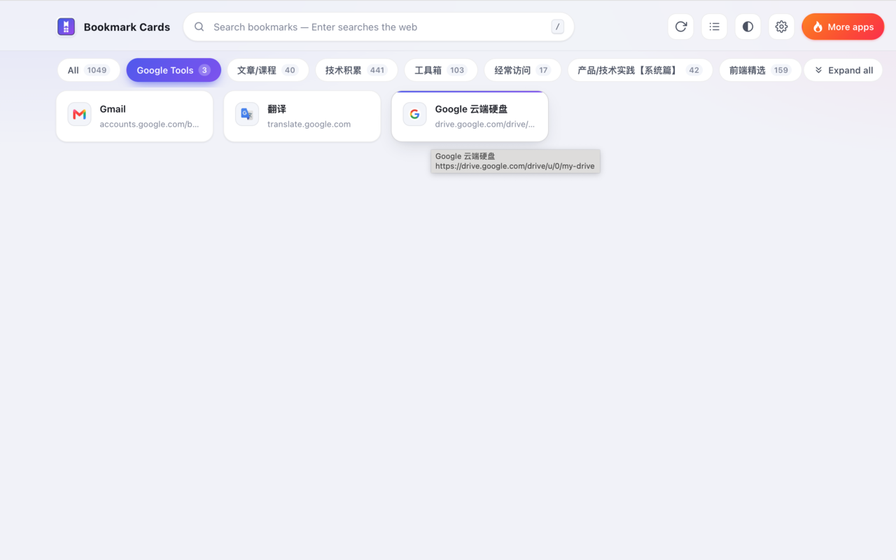

# bookmarks2html

**English** | [简体中文](README.zh-CN.md)

A Chrome extension (Manifest V3) that turns the bookmarks you already have into a clean,
readable, card-based homepage. Written in plain vanilla JS/CSS — **no build step, no third-party
dependencies** — and installed straight from the repo via "Load unpacked".

Design principle: **the extension collects nothing.** Your bookmark data comes from the browser's
own `chrome.bookmarks` API and is only read and rendered locally. The one and only network
behavior is the opt-in "page descriptions" feature that you enable yourself in settings.




> Light theme, English UI. Hovering a card shows a tooltip with the full title and URL.
> The capture predates the rename, so its header still shows the old brand — it will be replaced.

---

## Features

- **Takes over the new tab page** — `Ctrl`/`⌘` + `T` shows your bookmarks; clicking the toolbar
  icon opens the same homepage in a new tab (no popup).
- **Card grid** — one card per bookmark. Site icons come from Chrome's local favicon cache and
  fall back to a generated colored initial, so **a broken image never appears**.
- **Folder tabs + breadcrumb drill-down** — tabs are built from the subfolders of your
  bookmark-bar roots; keep drilling into nested folders and step back through the breadcrumb.
- **Instant search** — filters the whole tree as you type, highlights the match, can show each
  hit's folder path, and on Enter with no match searches the web with your chosen engine
  (Google / Bing / Baidu).
- **Page descriptions (optional, off by default)** — when enabled, the service worker reads each
  bookmark page's description and puts it on the card, caching results in `chrome.storage.local`
  with a 30-day TTL on success and 1-day on failure; cards fall back to the URL when a fetch fails.
- **Bilingual interface** — Simplified Chinese and English, with `auto` following
  `navigator.language`. Changing the language on the options page updates that page **and every
  open new-tab page live**, no reload needed.
- **Light / dark theme** — follow-system, light or dark; applied before first paint (no white
  flash) and cycle-able from the header button.
- **Two views** — cards (richer) or list (denser, one row per bookmark, multi-column on wide
  screens). The choice is remembered.
- **Expand all subfolders** — flatten every level of the current scope into one list with folder
  paths shown as chips; click again to collapse.
- **Three card sizes** — compact / comfortable / spacious.
- **Display toggles** — site icons, URLs, and folder paths in search results.
- **Live sync** — bookmark changes (`chrome.bookmarks` events) and setting changes
  (`chrome.storage.onChanged`) are reflected immediately, without reloading.
- **Manual refresh** — the header button re-reads the bookmark tree while keeping the active tab,
  folder and search state.
- **"More apps" entry** — a flame button on the right of the header opens
  <https://i.eatmango.cn/> (the author's other tools) in a new tab; it collapses to an icon-only
  button on narrow screens and needs no extra permission.
- **No-install dev preview** — a built-in `chrome.*` mock layer runs both pages in a normal
  browser tab.

---

## Install (load unpacked)

1. Clone or download this repository.
2. Open Chrome and go to `chrome://extensions`.
3. Enable **Developer mode** in the top-right corner.
4. Click **Load unpacked** and select **the root of this repository** (the folder containing `manifest.json`).
5. Open a new tab — your bookmark homepage is there (it also opens once right after install).

Requires **Chrome 102+** (uses the MV3 `favicon` API).

> **After editing the code**: click the **⟳ reload** button on this extension's card in
> `chrome://extensions`, then open a new tab — otherwise Chrome keeps running the old version.

---

## Usage

| Action | Result |
|--------|--------|
| Click a top **tab** | Switch to that folder |
| Click a **folder card** | Drill into it; use **← Back** in the breadcrumb to step out |
| Click a **bookmark card** | Opens the link in a **new tab in the current window** |
| `Ctrl`/`⌘` + click, middle click | Browser-native behavior (opens in a background tab) |
| **Expand all / Collapse** in the header | Flatten or restore every subfolder in the current scope |
| Header refresh / view / theme / gear | Re-read bookmarks, switch cards vs. list, cycle theme, open settings |
| Header **More apps** (flame button) | Opens <https://i.eatmango.cn/> in a new tab |

### Keyboard shortcuts (on the new tab page)

| Key | Function |
|-----|----------|
| `/` | Focus the search box |
| `Enter` | Open the first matching bookmark, or search the web when nothing matches |
| `Esc` | Clear the query and return to the current folder view |

---

## Settings

Open them from `chrome://extensions` → **Details** → **Extension options**, or via the gear icon on
the homepage. Everything is stored in `chrome.storage.sync`, so it follows your signed-in Chrome profile.

| Setting | Options | Default |
| --- | --- | --- |
| Language | System / 中文 / English | System |
| Theme | System / Light / Dark | System |
| View mode | Cards / List | Cards |
| Card size | Compact / Comfortable / Spacious | Comfortable |
| Site icons | On / off (falls back to a colored initial) | On |
| URLs | On / off | On |
| Folder path in search results | On / off | On |
| Page descriptions | On / off (requests site-data permission when turned on) | Off |
| Search engine | Google / Bing / Baidu | Google |

> "Fetch page descriptions" is off by default. Turning it on makes Chrome show a permission prompt;
> turning it off immediately revokes that permission and clears the cached descriptions.

---

## How it works

- `scripts/background.js` — service worker: seeds default settings on install, opens the homepage
  in a new tab when the icon is clicked, fetches bookmark page descriptions on demand into a local
  cache (separate success/failure TTLs), and clears that cache when the permission is revoked.
- `scripts/newtab.js` — the homepage: flattens `chrome.bookmarks.getTree()` into an index, renders
  tabs and cards, handles drill-down, search, expand-all, theme/view switching, and asks the
  background for missing descriptions.
- `scripts/shared.js` — the `B2H` module shared by both pages: settings read/write and change
  subscription, the zh/en string dictionary and `t()`, bookmark indexing and search, the icon-tile
  component, and URL/theme helpers.
- `scripts/theme-init.js` — applies the theme before stylesheets paint, so dark mode never flashes white.
- Plain left clicks on cards are intercepted by a delegated grid listener and routed through
  `chrome.tabs.create`, which is why links always open in a new tab **in the current window**.

---

## Permissions

| Permission | Why it is needed |
|------|------|
| `bookmarks` | Read the bookmark tree and listen for changes — this is the homepage's data source. |
| `favicon` | Fetch site icons through Chrome's local `_favicon/` endpoint; makes no network request. |
| `storage` | Store and sync your interface settings; the description cache lives in `chrome.storage.local`. |
| `optional_host_permissions: <all_urls>` | **Optional.** Requested only when you turn on "page descriptions", so the extension can visit the bookmark URLs themselves to read their description. Revoked as soon as you turn it off. |

No browsing history is read, no data is uploaded, and there is no analytics or advertising code.
Description requests explicitly omit credentials (no cookies) and the results stay on your machine.
The "More apps" button in the header is an ordinary `<a target="_blank">` link: it only opens when
you click it and requires no additional permission.

---

## Project structure

```
bookmarks2html/
├─ manifest.json           # MV3 manifest: permissions, new-tab override, options page
├─ newtab.html             # New tab page (bookmark homepage)
├─ options.html            # Settings page
├─ scripts/
│  ├─ background.js        # service worker: defaults, icon → homepage, description fetching
│  ├─ theme-init.js        # applies the theme before first paint
│  ├─ shared.js            # B2H module: settings, i18n dictionary, bookmark index, components
│  ├─ newtab.js            # homepage logic
│  └─ options.js           # settings page logic
├─ styles/
│  ├─ base.css             # design system: tokens, buttons, cards, themes
│  ├─ newtab.css           # homepage styles
│  └─ options.css          # settings page styles
├─ icons/                  # 16 / 32 / 48 / 128 px icons
├─ dev/
│  └─ mock-chrome.js       # chrome.* mock layer for the dev preview (50 sample bookmarks)
├─ dev-preview.html        # dev preview shell (fetches and injects the target page)
├─ docs/                   # GitHub Pages landing page, privacy policy, store listing copy
│  └─ assets/              # screenshot used by the landing page and this README
├─ scripts/package.sh      # builds the distributable zip
├─ TEST_CASES.md           # manual test checklist
├─ CHANGELOG.md
└─ LICENSE                 # Apache-2.0
```

---

## Testing

There is **no automated test runner** (the project is dependency-free by design). Work through
[`TEST_CASES.md`](TEST_CASES.md) in a real Chrome before each release.

Quick local run without installing the extension (uses the mocked `chrome.*` APIs and 50 sample
bookmarks):

```bash
python3 -m http.server 8899
# then open http://localhost:8899/dev-preview.html
```

- `dev-preview.html?page=options` — preview the settings page directly
- `dev-preview.html?clean=1` — hide the dev toolbar for a pixel-accurate view

The mock state is kept in localStorage under `b2h-dev-storage`; clear that key to reset. The
preview must be served over HTTP (`file://` cannot fetch the page source), hence the static server.

---

## Release packaging

Build a zip that contains **only what the extension needs to run** (runtime files plus `LICENSE`
for license compliance). `dev/`, `dev-preview.html`, `docs/`, `scripts/` and the Markdown docs are
excluded on purpose.

```bash
./scripts/package.sh
# → dist/bookmarks2html-v<version>.zip  (manifest.json at the zip root)
```

The version is read from `manifest.json` and kept in sync with `CHANGELOG.md`. The zip can be
uploaded to the Chrome Web Store as-is, or unpacked for "Load unpacked".

Store copy — single purpose statement, short description, release notes, per-permission
justifications, privacy policy URL and asset checklist — lives in
[`docs/store-listing.md`](docs/store-listing.md).

---

## Third-party libraries

**None.** Everything is hand-written vanilla JavaScript and CSS; no libraries, no build step.
The icons are PNGs generated for this repository and committed with it.

---

## FAQ

**Q: I don't want it to own my new tab page.**
Remove the `chrome_url_overrides` entry from `manifest.json` and reload the extension in
`chrome://extensions`. The toolbar icon still opens the bookmark homepage.

**Q: Why do some cards show a colored letter instead of an icon?**
Icons come from Chrome's local favicon cache, which has nothing for sites you have never visited.
The generated colored initial is the intended fallback.

**Q: Does the extension read my browsing history?**
No. It reads the bookmark tree and the local icon cache only, and uploads nothing. The single
network behavior is the opt-in description fetch, which visits your bookmark URLs without cookies
and caches results locally. Turn that switch off and the extension never touches the network.

---

## License

Apache License 2.0 — see [`LICENSE`](LICENSE).
